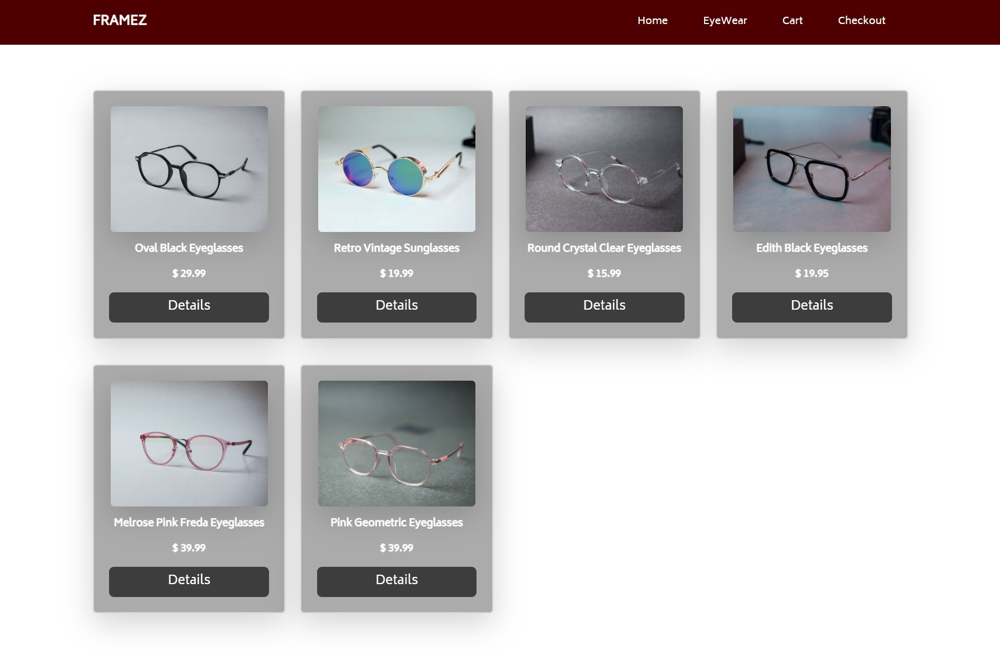
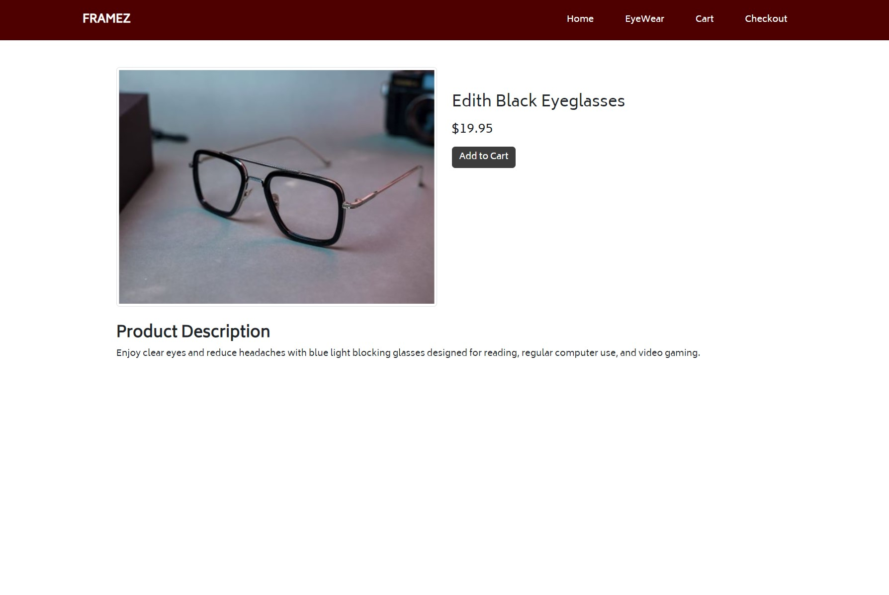
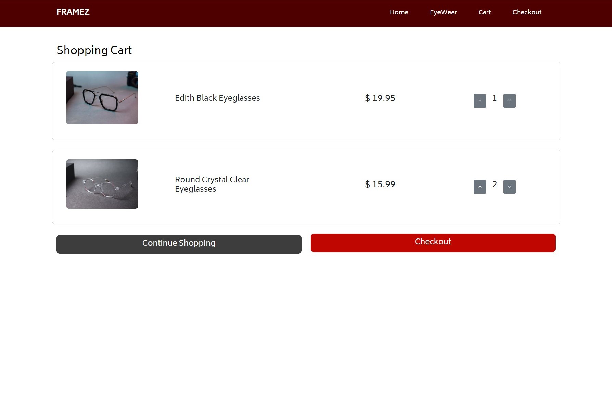
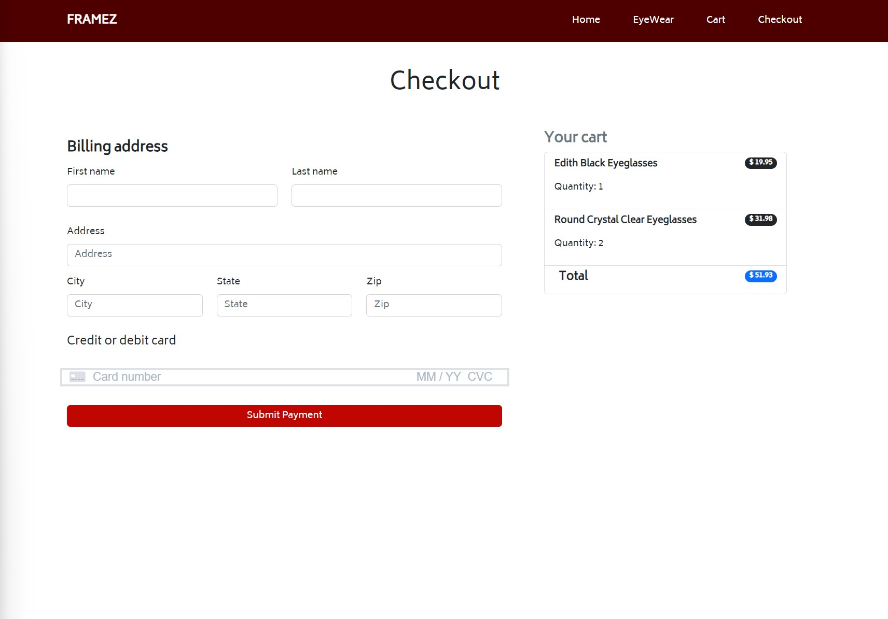
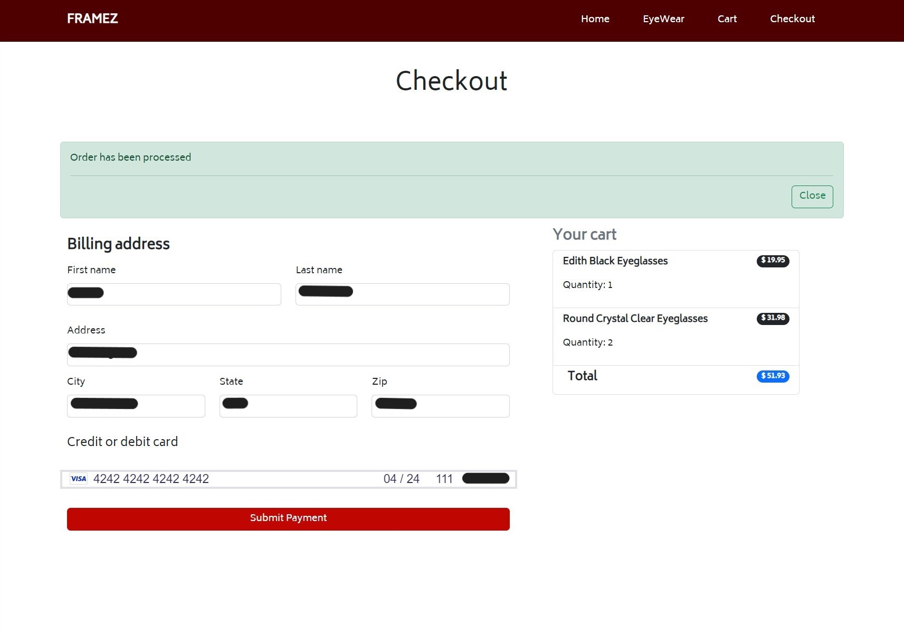
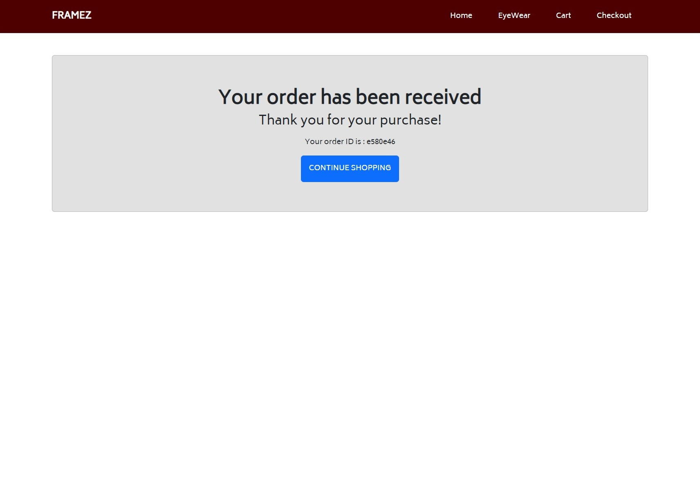

# FRAMEZ E-commerce Website

This is e-commerce website for eyewear company.

## Table of contents

- [Overview](#overview)
  - [Description](#description)
  - [Features](#features) 
- [Getting Started](#getting-started)
  - [Built with](#built-with)
  - [Dependencies](#dependencies)
  - [Before Installing](#before-installing)
  - [Installing](#installing)
  - [Executing program](#executing-program)
- [Author](#author)

## Overview

### Description

A responsive full-stack e-commerce store with payment functionality. This project is bootstrapped with Create React App.  

### Features

- Display featured products on home page.
- Administrator page for inventory management.
- Administrator authentication and authorization.
- Payment processing with Stripe.
- User can add and remove products from cart.
- User can adjust quantity.
- Order confirmation page with order number for users when payment is success.
- Checkout form validation.

### Screenshot














## Getting Started

### Built with
- React.js
- AWS Amplify
    - AWS Cognito
    - AWS API Gateway
    - AWS Lambda
    - AWS S3
    - AWS DynamoDB
- Bootstrap 
- CSS
- Mobile-first workflow

### Dependencies
- Stripe
- Formik
- Axios
- Yup
- Uuid
- React-Bootstrap
- React-Icons
- React-Router-Dom
- Amplify
- AWS-SDK

### Before Installing
* [Node.js](https://nodejs.org/en/) is needed.
* [npm](https://www.npmjs.com/) is needed.
* [AWS](https://aws.amazon.com/) account is needed.

### Installing

* Clone repository git clone 

```
https://github.com/whitneyharper/framez-online-store.git
```

* To install dependencies type [npm install] in the terminal 

```
npm install
```

### Executing program

* In the project directory, you can run the app type [npm start] in the terminal.

```
npm start
```

## Authors

- [@whitneyharper](https://github.com/whitneyharper)